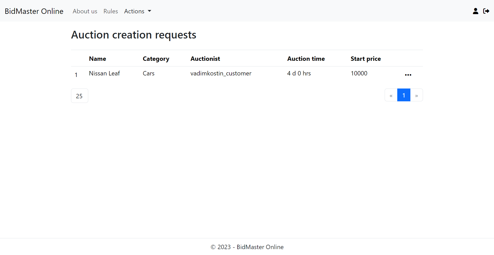

# AuctionsWebApp

"BidMasterOnline" - is a platform that provides you with oportunity to participate in auction, placing a bid at it, ororginize your own one. The platform allows you to determine the type of auction finishing: static finish time or increasing finish time after every new bid.

Also the system of technical supporthas been developed in this app. User can send technical support requests, file a complaint against other user`s auction or comment. Management all complaints and technical support reqeusts is a task of technical support specialist. To take action on the complaint he can block users account.

Admin - is main manager of the system, he can manage the staff and must verify user`s requests for creationg auctions.

There are some external web services that has been integrated into the app: Cloudinary - for keeping the images of auctions and profiles; Brevo - for sending notifications via the email; Stripe - for applying payment for the auction lots.

Main page:

